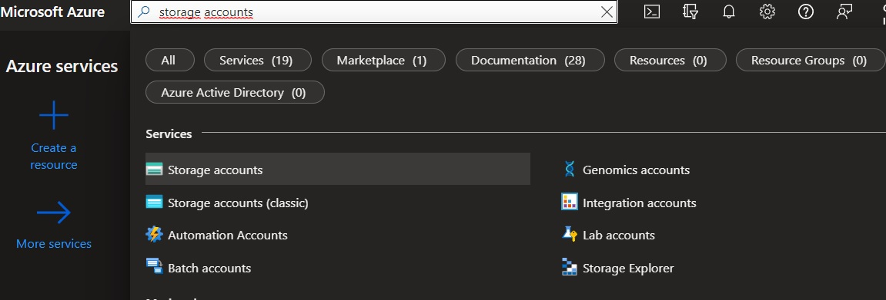
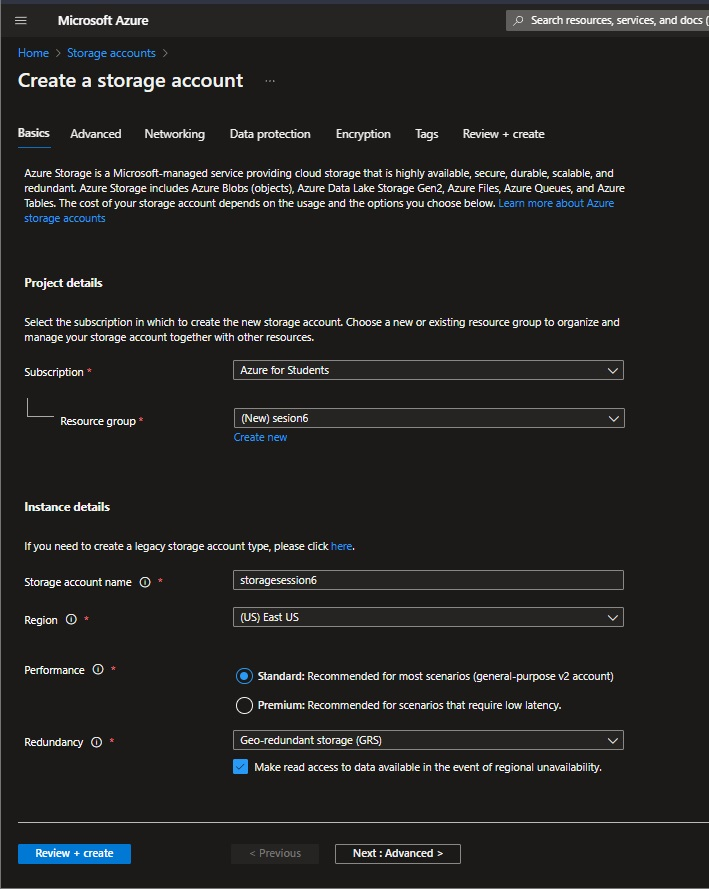
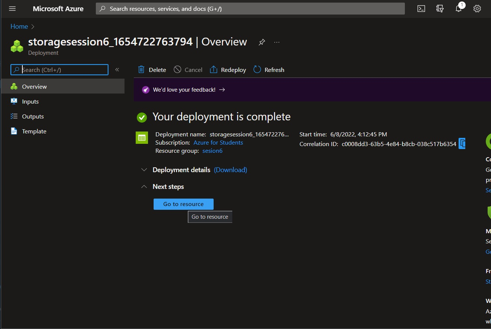
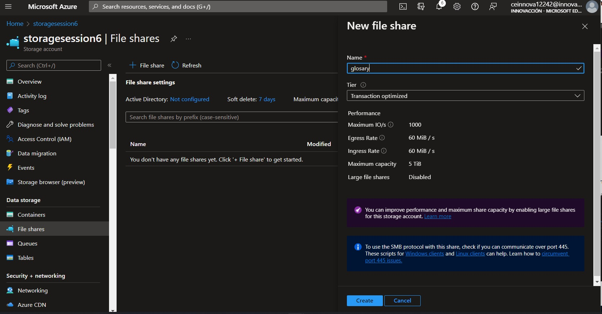
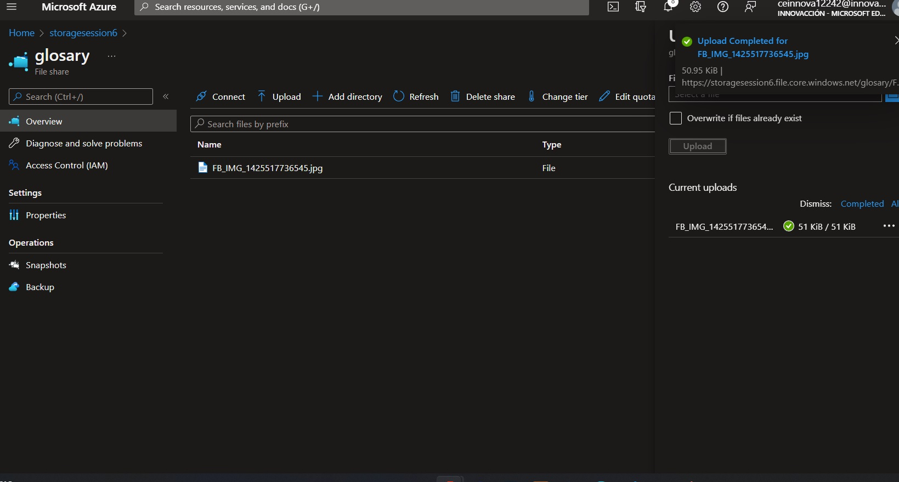
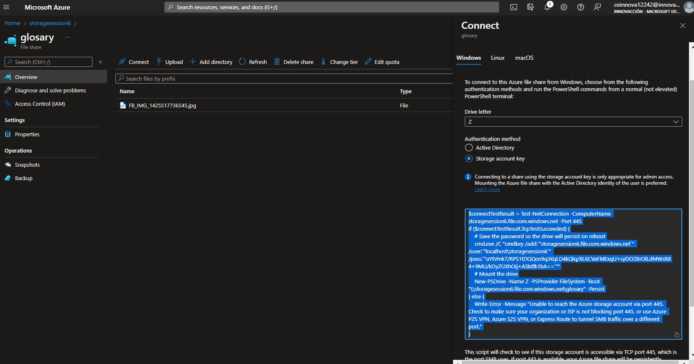
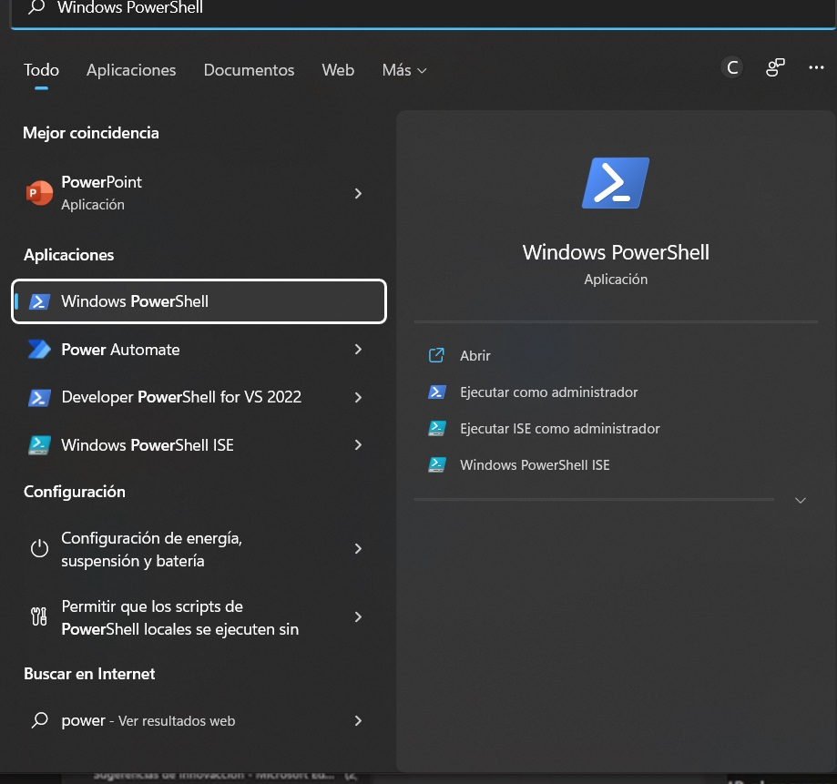
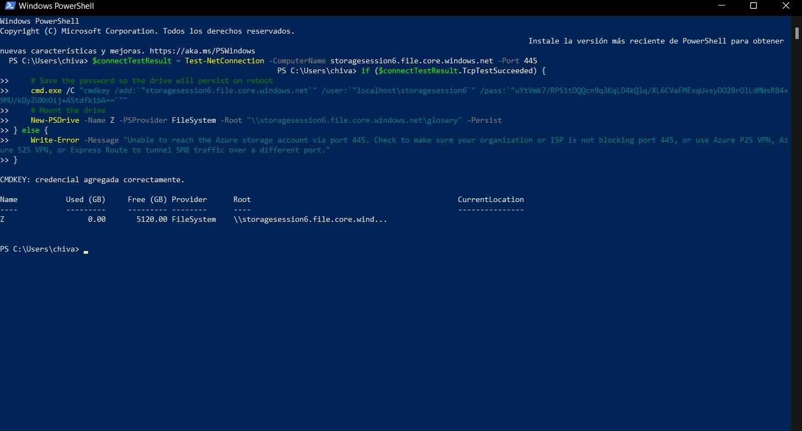

#Practice File Storage

----------------------------------------------------------------

 ## Process:
##### -We started session in  [Azure](https://www.portal.azure.com)
##### -In the search engine, we look for virtual machines, we click on it.

##### -We click on create.

##### -Then, we need to select a previusly created resource group or we can crete a new one.
##### -Set a storage account name and choose a region.
#### -We click on review + create.

##### -If the process is correct, we click on "GO TO RESOURCE"

##### -We have to select file shares.
##### -Click on "+ file share".
##### -on the right, set a name and click create.

##### -Open the file.
##### -Click on upload.
##### -On the right, chose a file and upload it.

##### -Click on connect.
##### -If you use windows, copy the windows command, if you use mac the mac command, or linux command, its depend of your device.

##### -In your computer, search "PowerShell" and open it.

##### -Paste the command and enter.
##### -We can see our file.

## Congratulations! this is File Storage